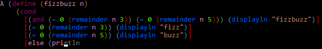

# Lush - The Lu Shell

Lush is an interactive [Racket](http://racket-lang.org/) shell. The above screenshot shows off some of its features:
* syntax highlighting
* matching bracket colouring (and highlights the matching open/close bracket when cursor is over a bracket)
* autocompletion of
  * special forms
  * user definitons
  * definitions from racket/{base/class/list}
* auto-indenting code
* a minimal Racket interpreter

It also features:
* basic support for running programs, piping and redirecting streams
* a user profile (~/.lush_profile) that stores user definitions that get loaded when lush starts

with new features constantly being added.

**Note: this is very much a work-in-progress**. Lush is not production ready, it is very incomplete and buggy. Feel free to try it out but keep in mind it is not stable.

# Installing

Lush requires a Linux environment. The Windows Subsystem for Linux is supported too.

It is advised to get the [latest release](https://github.com/patrick-lafferty/lush/releases/latest). Keep in mind any 0.x.y releases are considered unstable. 

Download the latest release:

wget https://github.com/patrick-lafferty/lush/releases/download/0.2.0/lush.tar.xz

Then extract lush some place you want:

tar xf lush.tar.xz

Running:

/path/you/extracted/lush/bin/lush

And thats it. The first time you start Lush it will create a file called .lush_profile in your home directory.

There is currently a [bug](https://github.com/racket/racket/issues/1712) in Racket 6.9 that affects Lush and requires building Racket from source until the next Racket release. So while its possible to build Lush from source its not currently supported.

See the [docs](https://patrick-lafferty.github.io/lush) for more information.
For a fantastic guide on Racket see [The Racket Guide](https://docs.racket-lang.org/guide/index.html)
